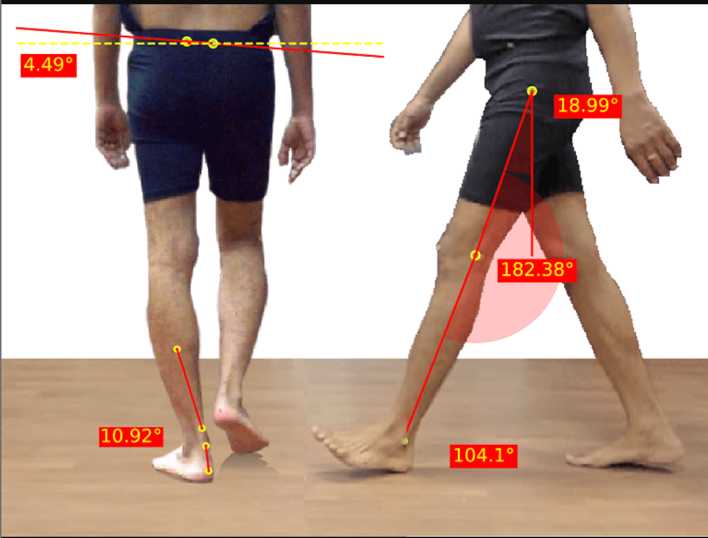

# Beginning Our Journey into Human Gait Analysis Using Computer Vision

In this Computer Vision Lab, my team and I began exploring real-world healthcare and rehabilitation challenges that could be addressed using classical computer vision techniques. Our objective was to identify a problem that was both practically relevant and technically feasible without relying heavily on deep learning frameworks.

During our initial exploration, we considered several domains. Applications such as traffic monitoring, facial recognition, and disease detection were evaluated. However, many of these problems required large annotated datasets and complex deep learning architectures, which were beyond the intended scope of a classical computer vision–based system.

After careful consideration, we identified a significant healthcare challenge: human gait analysis for rehabilitation and mobility assessment.

---

## Understanding the Problem

Human gait refers to the pattern of walking exhibited by an individual. In rehabilitation centres and physiotherapy clinics, gait assessment is often performed through manual observation. Clinicians visually evaluate posture, stride length, walking symmetry, and balance to assess recovery progress.

While this method is valuable, it presents several limitations:

- Subjective interpretation  
- Inconsistency across sessions  
- Difficulty detecting subtle improvements  
- Lack of quantifiable data for long-term tracking  

These limitations highlighted the need for a system capable of transforming walking patterns into measurable and objective data.

---

## Our Approach

To address this problem, we propose a computer vision–based gait analysis system that processes walking videos and extracts meaningful motion and shape information.

Our system is designed to:

- Capture walking sequences using a fixed camera setup  
- Extract silhouettes from video frames  
- Analyse motion across time  
- Compute gait-related metrics such as stride length, walking speed, and step frequency  
- Classify gait patterns into normal or abnormal categories  

Unlike deep learning-heavy solutions, our focus is on building an interpretable and structured pipeline using classical computer vision techniques. This ensures computational efficiency and makes the system suitable for controlled rehabilitation environments.

---

## Initial Challenges

As we begin development, we recognise several technical challenges:

- Ensuring consistent lighting and background conditions  
- Accurately extracting clean silhouettes  
- Detecting subtle motion variations  
- Maintaining feature consistency across sessions  
- Designing a reliable classification strategy  

Addressing these challenges will require careful experimentation and systematic evaluation.

---

## Moving Forward

This project represents more than a technical implementation. It is an opportunity to bridge computer vision with practical healthcare applications. By transforming visual walking patterns into quantitative insights, we aim to contribute toward more objective and data-driven rehabilitation assessment.

In the upcoming sections, we will detail the system architecture, processing pipeline, and feature extraction strategies that form the foundation of our gait analysis framework.

Stay tuned as we continue documenting our progress and technical development.